# Architecture map

A one-page picture of brachify. Detail lives in
[project/COSC499-TEAM10-PROJECT-DOCS.md](project/COSC499-TEAM10-PROJECT-DOCS.md).
When the two disagree, that file wins, and when that file disagrees with the code, the code wins.

*Reasoned from code*, read 2026-09-24. Runtime checks are marked *Verified* only where the project docs already recorded them.

## What the app does

A clinician exports a brachytherapy plan as DICOM. brachify builds a patient-specific cylinder with needle holes, an optional tandem, a notch, and an optional collar, then writes a printable mesh and a PDF reference sheet.

## Already built

This is the upstream app. Team 10 has not changed `src/`.

The three pictures below are the map. They are *Reasoned from code*. The editor preview does not draw a mermaid block, so each picture is an SVG in [diagrams/](diagrams/). The `.mmd` file beside each SVG is the same diagram. When you redraw one, render the `.mmd` again and replace the SVG. Redraw all three in the same change when signals, values, the view order, a model, `ShapeModel`, the display path, or an export input or output changes. [AGENTS.md](../AGENTS.md) tells agents to do that before a pull request, and [workflows/make-pr.md](workflows/make-pr.md) blocks opening the PR until it is done.

To zoom and pan when a picture gets crowded, open [diagrams/viewer.html](diagrams/viewer.html) in a browser. Scroll zooms, drag moves, and each picture has its own size.

### UML

Who owns what. `RadiotherapyApp.signals` announces changes. `RadiotherapyApp.values` holds the shared settings dict. Views are reached by index on `NavigationModel`, 0 through 4. Do not reorder them.

`DicomModel` does not build a `ShapeModel`. It loads the plan and notifies the cylinder and channel models.

### DFD level 0

The app as one process.

### DFD level 1

The same process opened into the five tabs. The viewport is not a sixth process. It paints shapes. That path is the UML, from the geometry models to `ShapeModel` to `DisplayModel`.

Five tabs, in this fixed order. The code addresses them by index. Do not reorder them.

| Tab | What it does |
|---|---|
| Import | Reads the first RTPLAN and RTSTRUCT. Needs a channel named `Central Axis`. Varian is the path the sample data exercises. Nucletron exists in code and has no sample here. |
| Cylinder | Diameter, length, optional collar. Length changes move needles by an offset. Original DICOM points stay put. |
| Channels | Bore diameter, dead space, threading. A channel can be disabled or marked as the tandem. |
| Tandem | Generate a curved channel, or import a STEP model. |
| Export | Cuts channels and tandem out of the cylinder. Writes STL, STEP, the PDF, and a JSON config. |

A view method that changes geometry must use `@display_action`, or the model updates and the viewport does not. The shape path is in the UML above.

## What Team 10 has added

Course scaffolding only. No application behaviour.

| In the repo | Not in the repo |
|---|---|
| This documentation set, agent rules, commit and PR workflows | Tests |
| The anti-slop lint hook, which does not read Python | CI |
| macOS setup notes in the project docs | Changes to `src/` |

## What the next eight months are supposed to be

**Not written down in this repository.**

- [docs/proposal/](proposal/README.md) is a placeholder.
- The team contract is a Google Doc, linked from [docs/contract/](contract/README.md). It was not read for this map.
- GitHub Issues are disabled on this fork.

Do not treat the list below as the course plan. It is only unfinished work the code and the project docs already name.

| Gap | Why it matters |
|---|---|
| Collar height and thickness are dropped when a tandem is generated, and they are missing from an exported config | A printed collar can disappear. Recorded in §7.1. |
| No tests for the DICOM-to-cylinder rotation, config load, point cleanup, or the PDF length maths | Those functions decide needle position and the sheet a clinician reads. Listed in §8. |
| Nucletron import has no sample plan in the repo | Half of the DICOM reader is unexercised. |
| Needle collision checks are not called | Intersecting needles are a clinical precondition the app does not enforce. |

When the proposal or the sponsor brief is available, replace this section with the real eight-month work. Until then this file does not invent it.
