# System Architecture

A one-page picture of brachify. Detail lives in
[project/COSC499-TEAM10-PROJECT-DOCS.md](../project/COSC499-TEAM10-PROJECT-DOCS.md).
When the two disagree, that file wins, and when that file disagrees with the code, the code wins.

*Reasoned from code*, read 2026-09-24. Runtime checks are marked *Verified* only where the project docs already recorded them.

## What the app does

A clinician exports a brachytherapy plan as DICOM. brachify builds a patient-specific cylinder with needle holes, an optional tandem, a notch, and an optional collar, then writes a printable mesh and a PDF reference sheet.

## Already built

This is the upstream app. Team 10 has not changed `src/`.

The four pictures below are the map. They are *Reasoned from code*. Everything about them lives
in this folder, and this README is the only place that says when and how to redraw them.

### Keeping the pictures current

Edit only the `.mmd` files in [diagrams/](diagrams/). Everything else is derived.

```bash
python docs/architecture/build.py          # re-render stale SVGs, refresh viewer.html
python docs/architecture/build.py --check  # change nothing, exit 1 if anything is stale
python docs/architecture/build.py --install-hook   # once per clone, builds on a .mmd commit, checks on a src/ commit
```

The build needs Node (it runs mermaid-cli through `npx`). Each SVG carries the hash of its source,
so `--check` cannot be fooled by timestamps. The hash is taken over LF line endings, so a Windows
checkout with CRLF matches a stamp written on macOS or Linux. It also fails when a diagram is not embedded below.

**Redraw when** signals, values, the view order, a model, `ShapeModel`, the display path, or what
Import reads or Export writes changes. Redraw all four in the same change, before the pull
request. If none of those changed, leave the pictures alone.

**The system architecture is also checked against `src/`.** `--check` fails when a module in
`src/classes/{dicom,mesh,pdf}/`, `src/settings/`, a `*_model.py` or a `*_view.py` is not named in
[system-architecture.mmd](diagrams/system-architecture.mmd). Adding a file therefore forces a
diagram edit. The check cannot see a change that adds no file, so also redraw that diagram when a
layer, a library, a file the app reads or writes, or the direction of a dependency changes. Edit
the `.mmd` by hand: each domain line (`mesh:`, `pdf:`, ...) lists the module names, and the other
boxes are prose.

Other documents link here and do not repeat this rule. If the rule changes, change it here.

| File | Role | Edit by hand? |
|---|---|---|
| `diagrams/**/*.mmd` | the diagram sources | yes |
| `diagrams/**/*.svg` | rendered pictures, shown below | no, run `build.py` |
| `viewer.html` | zoom and pan page, its list of pictures is generated | no, run `build.py` |
| `build.py` | the build and the check | when the tooling changes |

To zoom and pan when a picture gets crowded, open [viewer.html](viewer.html) in a browser. Scroll
zooms, drag moves, and each picture has its own size.

### System architecture

The whole application as layers, from the people and files outside it down to the libraries and
disk it stands on. Read it top to bottom: the plan and the settings come in through the views,
the views drive the models, the models call the domain services, and the services use the
libraries and disk. Two arrows point back up: outputs leave through the Export view, and
`shapes_changed` carries finished shapes from the models to the canvas.



| Layer | Contents | Source |
|---|---|---|
| External | TPS DICOM export, config JSON, tandem STEP file, STL and STEP out, PDF out | outside the repo |
| Presentation | `MainWindow`, the five views, the OpenCASCADE canvas | `src/windows/` |
| Application state | `RadiotherapyApp`, `NavigationModel`, `DicomModel`, the geometry models, `DisplayModel` and `ShapeModel` | `src/classes/app.py`, `src/windows/models/` |
| Domain services | DICOM readers, OpenCASCADE geometry, PDF sheet, config load and reset | `src/classes/dicom/`, `mesh/`, `pdf/`, `src/settings/` |
| Libraries | PySide6, pythonocc-core, pydicom, reportlab, matplotlib | conda environment |
| Local storage | `app.log` and `filepaths.json` in `~/brachify` | `src/classes/info.py` |

It is a single process desktop app. There is no server, database or network call. Views reach
other views by index and reach the models through `get_app().window`, so the layering above is the
intended direction of dependency, not one the code enforces. Export is the exception that shows it:
`Export_View` reads the cylinder, channel and tandem models directly and runs the boolean cut
itself.

### UML

Who owns what. `RadiotherapyApp.signals` announces changes. `RadiotherapyApp.values` holds the shared settings dict. Views are reached by index on `NavigationModel`, 0 through 4. Do not reorder them.


`DicomModel` does not build a `ShapeModel`. It loads the plan and notifies the cylinder and channel models.

### DFD level 0

The app as one process.


### DFD level 1

The same process opened into the five tabs. The viewport is not a sixth process. It paints shapes. That path is the UML, from the geometry models to `ShapeModel` to `DisplayModel`.



Five tabs, in this fixed order. The code addresses them by index. Do not reorder them.

| Tab | What it does |
|---|---|
| Import | Reads the first RTPLAN and RTSTRUCT. Needs a channel named `Central Axis`. Varian is the path the sample data exercises. Nucletron exists in code and has no sample here. |
| Cylinder | Diameter, length, optional collar. Length changes move needles by an offset. Original DICOM points stay put. |
| Channels | Bore diameter, dead space, threading. A channel can be disabled or marked as the tandem. |
| Tandem | Generate a curved channel, or import a STEP model. |
| Export | Cuts channels and tandem out of the cylinder. Writes STL, STEP, the PDF, and a JSON config. |

A view method that changes geometry must use `@display_action`, or the model updates and the viewport does not. The shape path is in the UML above.

## What Team 10 has added

Course scaffolding only. No application behaviour.

| In the repo | Not in the repo |
|---|---|
| This documentation set, agent rules, commit and PR workflows | Tests of application behaviour |
| Tooling tests and the manually run anti-slop-py linter | CI |
| macOS setup notes in the project docs | Changes to `src/` |

## Proposed project framework

The [project proposal](../proposal/README.md) now describes structure visualization,
cylinder and needle editing, design checks, templates and consistent exports.
[projected-framework/](diagrams/projected-framework/) contains separate UML,
DFD level 0 and DFD level 1 diagrams for that scope. These are proposed responsibilities,
reasoned from the proposal, not implemented APIs or verified clinical behaviour.

The build recursively discovers diagrams in both `existing-framework/` and
`projected-framework/`, as well as the top-level system architecture. Run the commands
above to regenerate the viewer and stale SVGs; `--check` covers all seven diagrams.
The existing application's behaviour has not changed, so its four diagram sources did
not require a redraw. The UML and DFD paths changed to keep existing and proposed
behaviour separate.

### Projected UML



### Projected DFD level 0



### Projected DFD level 1



The proposal's milestone 1 FR-SV-01–07 maps to structure reconstruction, display state
and anatomy checks. FR-CN-01–20 maps to design editing, templates, history, validation
and exports. Milestone 2 describes the corresponding review and editing controls.
Class names in the projected UML express a design proposal; storage formats, clinical
thresholds and the concrete UI arrangement still need implementation decisions.
