# System Architecture

A one-page picture of brachify. Detail lives in
[project/COSC499-TEAM10-PROJECT-DOCS.md](../project/COSC499-TEAM10-PROJECT-DOCS.md).
When the two disagree, that file wins, and when that file disagrees with the code, the code wins.

*Reasoned from code*, read 2026-09-24. Runtime checks are marked *Verified* only where the project docs already recorded them.

## What the app does

A clinician exports a brachytherapy plan as DICOM. brachify builds a patient-specific cylinder with needle holes, an optional tandem, a notch, and an optional collar, then writes a printable mesh and a PDF reference sheet.

## Already built

This is the upstream app. Team 10 has not changed `src/`.

The three pictures below are the map. They are *Reasoned from code*. Everything about them lives
in this folder, and this README is the only place that says when and how to redraw them.

### Keeping the pictures current

Edit only the `.mmd` files in [diagrams/](diagrams/). Everything else is derived.

```bash
python docs/architecture/build.py          # re-render stale SVGs, refresh viewer.html
python docs/architecture/build.py --check  # change nothing, exit 1 if anything is stale
python docs/architecture/build.py --install-hook   # once per clone, does the build at commit time
```

The build needs Node (it runs mermaid-cli through `npx`). Each SVG carries the hash of its source,
so `--check` cannot be fooled by timestamps. It also fails when a diagram is not embedded below.

**Redraw when** signals, values, the view order, a model, `ShapeModel`, the display path, or what
Import reads or Export writes changes. Redraw all three in the same change, before the pull
request. If none of those changed, leave the pictures alone.

Other documents link here and do not repeat this rule. If the rule changes, change it here.

| File | Role | Edit by hand? |
|---|---|---|
| `diagrams/*.mmd` | the diagram sources | yes |
| `diagrams/*.svg` | rendered pictures, shown below | no, run `build.py` |
| `viewer.html` | zoom and pan page, its list of pictures is generated | no, run `build.py` |
| `build.py` | the build and the check | when the tooling changes |

To zoom and pan when a picture gets crowded, open [viewer.html](viewer.html) in a browser. Scroll
zooms, drag moves, and each picture has its own size.

### UML

Who owns what. `RadiotherapyApp.signals` announces changes. `RadiotherapyApp.values` holds the shared settings dict. Views are reached by index on `NavigationModel`, 0 through 4. Do not reorder them.



`DicomModel` does not build a `ShapeModel`. It loads the plan and notifies the cylinder and channel models.

### DFD level 0

The app as one process.



### DFD level 1

The same process opened into the five tabs. The viewport is not a sixth process. It paints shapes. That path is the UML, from the geometry models to `ShapeModel` to `DisplayModel`.



Five tabs, in this fixed order. The code addresses them by index. Do not reorder them.

| Tab | What it does |
|---|---|
| Import | Reads the first RTPLAN and RTSTRUCT. Needs a channel named `Central Axis`. Varian is the path the sample data exercises. Nucletron exists in code and has no sample here. |
| Cylinder | Diameter, length, optional collar. Length changes move needles by an offset. Original DICOM points stay put. |
| Channels | Bore diameter, dead space, threading. A channel can be disabled or marked as the tandem. |
| Tandem | Generate a curved channel, or import a STEP model. |
| Export | Cuts channels and tandem out of the cylinder. Writes STL, STEP, the PDF, and a JSON config. |

A view method that changes geometry must use `@display_action`, or the model updates and the viewport does not. The shape path is in the UML above.

## What Team 10 has added

Course scaffolding only. No application behaviour.

| In the repo | Not in the repo |
|---|---|
| This documentation set, agent rules, commit and PR workflows | Tests |
| The anti-slop lint hook, which does not read Python | CI |
| macOS setup notes in the project docs | Changes to `src/` |

## What the next eight months are supposed to be

**Not written down in this repository.**

- [docs/proposal/](../proposal/README.md) is a placeholder.
- The team contract is a Google Doc, linked from [docs/contract/](../contract/README.md). It was not read for this map.
- GitHub Issues are disabled on this fork.

Do not treat the list below as the course plan. It is only unfinished work the code and the project docs already name.

| Gap | Why it matters |
|---|---|
| Collar height and thickness are dropped when a tandem is generated, and they are missing from an exported config | A printed collar can disappear. Recorded in §7.1. |
| No tests for the DICOM-to-cylinder rotation, config load, point cleanup, or the PDF length maths | Those functions decide needle position and the sheet a clinician reads. Listed in §8. |
| Nucletron import has no sample plan in the repo | Half of the DICOM reader is unexercised. |
| Needle collision checks are not called | Intersecting needles are a clinical precondition the app does not enforce. |

When the proposal or the sponsor brief is available, replace this section with the real eight-month work. Until then this file does not invent it.
